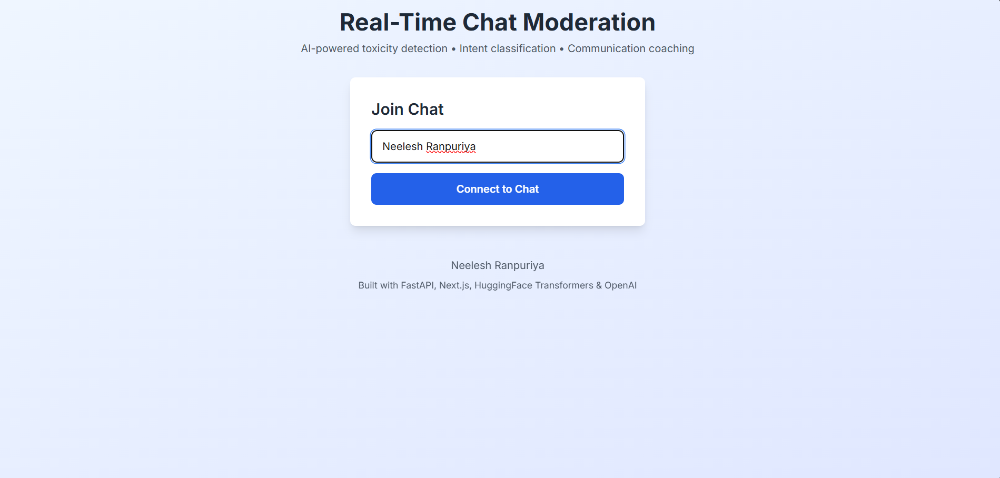
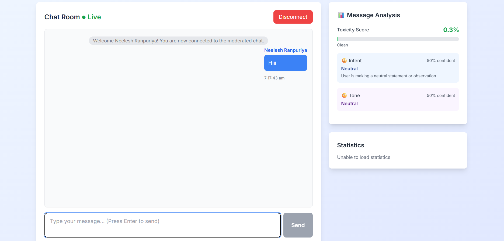
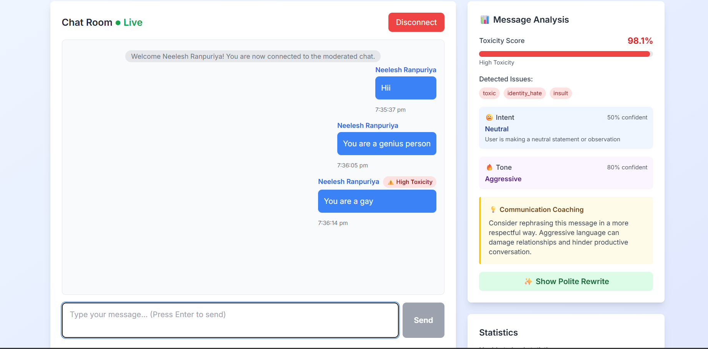

# Real-time-chat-moderation-
An AI-powered real-time chat moderation platform built with FastAPI and WebSockets that detects toxic messages, classifies intent, analyzes tone, and provides polite coaching suggestions instantly.

##  Project Overview  

This project helps maintain healthy conversations by:  
- Detecting toxic or rude messages  
- Analyzing tone and intent  
- Suggesting polite rewrites  
- Giving communication coaching  
- Moderating chats in real-time  

---

##  Features  

- Real-time message analysis  
- Toxicity detection (AI-based)  
- Intent classification  
- Tone analysis  
- Polite rewrite suggestions  
- Communication coaching  
- Live chat with WebSockets  
- Message history  
- Admin delete actions  
- Statistics dashboard  

---

##  Tech Stack 

### Backend  
- FastAPI  
- WebSockets  
- SQLAlchemy  
- PostgreSQL / SQLite  
- Uvicorn  

### AI / ML  
- HuggingFace (`toxic-bert`)  
- OpenAI (tone + rewrite)  
- PyTorch  

### Frontend  
- Next.js  
- TypeScript  
- Tailwind CSS  
- Axios  

---
## 📊 Dataset Details  

This project uses a mix of public and custom datasets for training and testing.

### 1. Toxic Comment Dataset  
**Source:** Jigsaw / Conversation AI (Kaggle)  
**Purpose:** Used for toxicity detection.

🔗 Download:  
https://www.kaggle.com/c/jigsaw-toxic-comment-classification-challenge/data  

---

### 2. Intent Classification Dataset (Custom)  
**File:** `datasets/intent_classification.csv`  
**Purpose:** Classifies user intent (question, insult, threat, etc.)

---

### 3. Polite Rewrite Dataset (Custom)  
**File:** `datasets/polite_rewrites.csv`  
**Purpose:** Generates polite alternatives for toxic messages.

---

### Folder Structure

## 📁 Project Structure  
```
webapp/
├── backend/
├── frontend/
├── datasets/
├── screenshots/
├── docs/
└── README.md
```


---

## ⚙ Installation  

### Backend  
```bash
cd backend
python -m venv venv
venv\Scripts\activate   # Windows
pip install -r requirements.txt
uvicorn main:app --reload
```

### Frontend
```
cd frontend
npm install
npm run dev
```

### Usage

- Open http://localhost:3000
- Enter username
- Start chatting
- Each message shows:
- Toxicity score
- Intent
- Tone
- Coaching message
- Suggested rewrite

## Screenshots
### 1. **Home Page**


### 2. **Chat Interface**


### 3. **Real-Time Analysis Panel**


### API
- REST
- GET /api/health
- POST /api/analyze
- GET /api/messages
- GET /api/stats
- DELETE /api/messages/{id}
- WebSocket
- ws://localhost:8000/ws/{username}

### Future Enhancements

- User authentication
- Admin dashboard
- Multi-language support
- Profanity filter
- Export chat logs

### Contact

**Neelesh Ranpuriya**
- Github: https://github.com/NeeleshRanpuriya
- Email: Neeleshranpuriya@gmail.com
- Linkedin: www.linkedin.com/in/neelesh-ranpuriya-0920512b2
  


